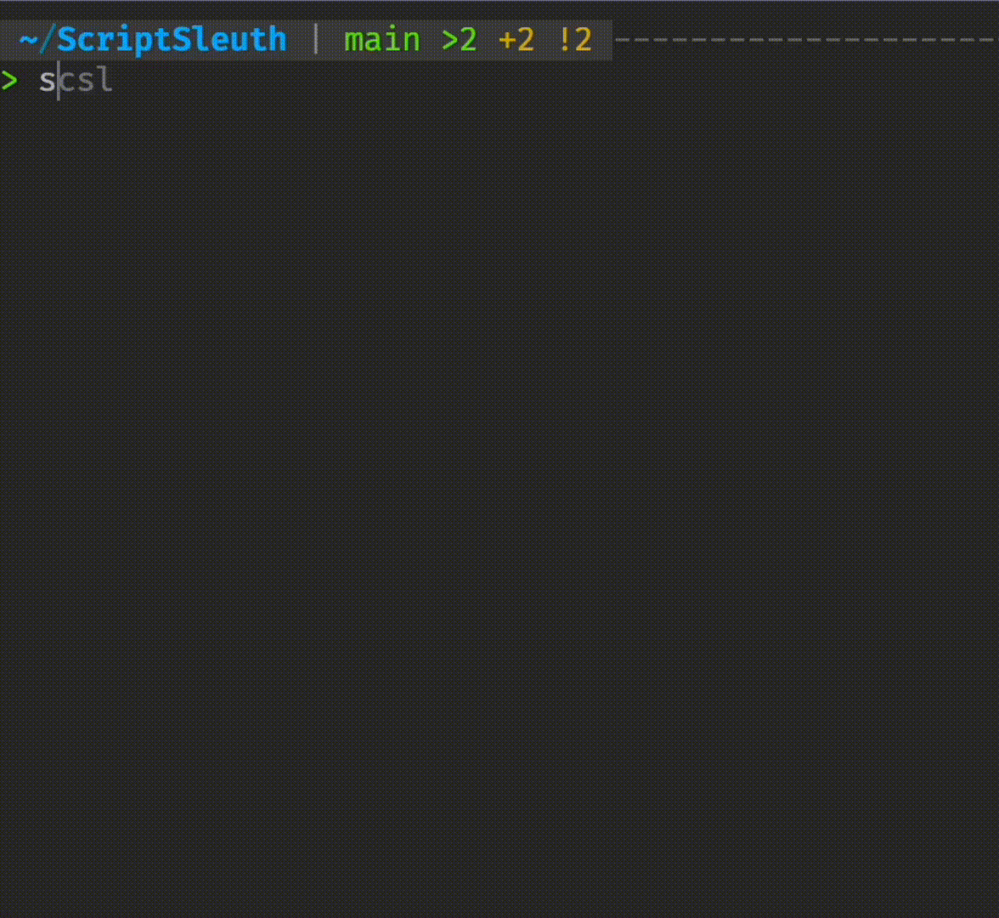

[](https://www.npmjs.com/package/scriptsleuth?activeTab=readme)
# ScriptSleuth

ScriptSleuth is a Node.js command-line interface (CLI) tool designed to help developers quickly run scripts defined in a `package.json` file.

## Features

- Interactive prompt to select a script from `package.json`
- Customizable script runner (npm, yarn, pnpm, etc.)
- Simple and intuitive user interface
- Fast and non-blocking script execution

## Installation

You can install ScriptSleuth globally on your system using npm:

```bash
npm install -g scriptsleuth
```

## Usage

To run ScriptSleuth, simply run the following command in your terminal, In owning package.json file directory:

```bash
scsl

scsl -p pnpm # Use pnpm as the script runner
```


